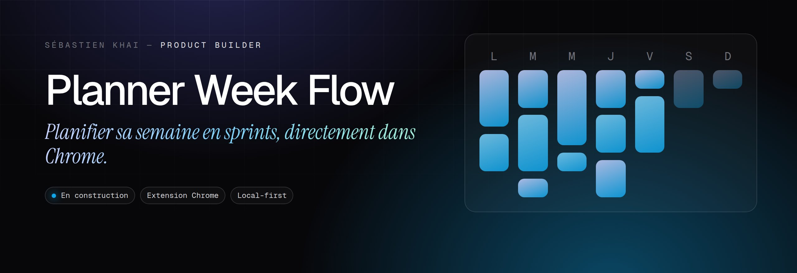

  
  

<h1 align="center">Planner Week Flow</h1>

<b>Planifier sa semaine en sprints, directement dans Chrome.</b> Une extension de planification hebdomadaire : tâches, catégories, priorités et historique des sprints, entièrement en local.

---

### Le problème

Les gestionnaires de tâches sont souvent trop lourds pour simplement organiser sa semaine.

### L'idée

Appliquer la logique des sprints à sa semaine : capacité quotidienne, priorités, bilan.

### Comment c'est fait

Extension Chrome sans serveur : données stockées dans le navigateur, rappel optionnel, création de tâche par clic droit.

**Outils** &nbsp; `Extension Chrome` `Local-first`

### Mentions

Ce dépôt héberge la politique de confidentialité de l'extension (`index.html`, adresse utilisée par le Chrome Web Store) : ne pas la renommer.

### English

**Planner Week Flow** — *Plan your week in sprints, right inside Chrome.* A weekly planning extension: tasks, categories, priorities and sprint history, fully local.

Task managers are often too heavy just to organise your week. Apply sprint logic to your week: daily capacity, priorities, review. A serverless Chrome extension: data stored in the browser, optional reminder, create a task with a right-click.

---

Conçu, développé et mis en ligne par <b>Sébastien Khai</b>, Product Builder · <a href="https://engob.github.io/portofolio/">portfolio</a> · <a href="https://engob.github.io/portofolio/">fiche du projet</a> © 2026 Sébastien Khai — tous droits réservés.

